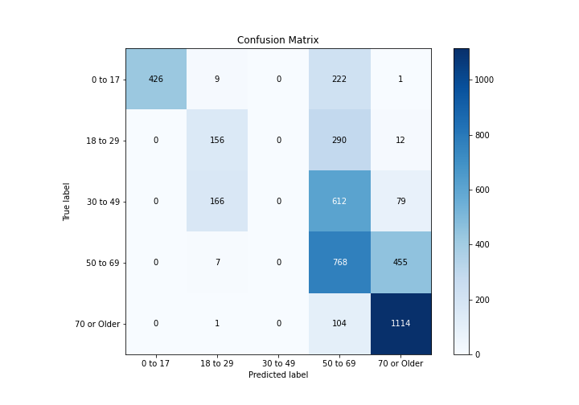

# Summary of 2_DecisionTree

[<< Go back](../README.md)

## Decision Tree
- **n_jobs**: -1
- **criterion**: gini
- **max_depth**: 3
- **num_class**: 5
- **explain_level**: 2

## Validation
 - **validation_type**: split
 - **train_ratio**: 0.75
 - **shuffle**: True
 - **stratify**: True

## Optimized metric
logloss

## Training time

18.2 seconds

### Metric details
|           |    0 to 17 |   18 to 29 |   30 to 49 |    50 to 69 |   70 or Older |   accuracy |   macro avg |   weighted avg |   logloss |
|:----------|-----------:|-----------:|-----------:|------------:|--------------:|-----------:|------------:|---------------:|----------:|
| precision |   1        |   0.460177 |          0 |    0.38477  |      0.67068  |   0.557214 |    0.503125 |       0.488373 |   1.00623 |
| recall    |   0.647416 |   0.340611 |          0 |    0.62439  |      0.913864 |   0.557214 |    0.505256 |       0.557214 |   1.00623 |
| f1-score  |   0.785978 |   0.391468 |          0 |    0.476131 |      0.773611 |   0.557214 |    0.485438 |       0.503198 |   1.00623 |
| support   | 658        | 458        |        857 | 1230        |   1219        |   0.557214 | 4422        |    4422        |   1.00623 |

## Confusion matrix
|                        |   Predicted as 0 to 17 |   Predicted as 18 to 29 |   Predicted as 30 to 49 |   Predicted as 50 to 69 |   Predicted as 70 or Older |
|:-----------------------|-----------------------:|------------------------:|------------------------:|------------------------:|---------------------------:|
| Labeled as 0 to 17     |                    426 |                       9 |                       0 |                     222 |                          1 |
| Labeled as 18 to 29    |                      0 |                     156 |                       0 |                     290 |                         12 |
| Labeled as 30 to 49    |                      0 |                     166 |                       0 |                     612 |                         79 |
| Labeled as 50 to 69    |                      0 |                       7 |                       0 |                     768 |                        455 |
| Labeled as 70 or Older |                      0 |                       1 |                       0 |                     104 |                       1114 |

## Learning curves

## Decision Tree 

### Tree #1

### Rules

if (Birth Weight <= 250.0) and (Payment Typology 1 > 4.5) and (Payment Typology 1 <= 5.5) then class: 70 or Older (proba: 66.4%) | based on 4,958 samples

if (Birth Weight <= 250.0) and (Payment Typology 1 <= 4.5) and (APR MDC Description <= 22.5) then class: 50 to 69 (proba: 39.3%) | based on 3,814 samples

if (Birth Weight <= 250.0) and (Payment Typology 1 > 4.5) and (Payment Typology 1 > 5.5) then class: 50 to 69 (proba: 37.68%) | based on 2,033 samples

if (Birth Weight > 250.0) then class: 0 to 17 (proba: 100.0%) | based on 1,335 samples

if (Birth Weight <= 250.0) and (Payment Typology 1 <= 4.5) and (APR MDC Description > 22.5) then class: 18 to 29 (proba: 49.16%) | based on 1,125 samples

## Permutation-based Importance

## Confusion Matrix

## Normalized Confusion Matrix

## ROC Curve

## Precision Recall Curve

## SHAP Importance

## SHAP Dependence plots

### Dependence 0 to 17 (Fold 1)

### Dependence 18 to 29 (Fold 1)

### Dependence 30 to 49 (Fold 1)

### Dependence 50 to 69 (Fold 1)

### Dependence 70 or Older (Fold 1)

## SHAP Decision plots

### Worst decisions for selected sample 1 (Fold 1)

### Worst decisions for selected sample 2 (Fold 1)

### Worst decisions for selected sample 3 (Fold 1)

### Worst decisions for selected sample 4 (Fold 1)

### Best decisions for selected sample 1 (Fold 1)

### Best decisions for selected sample 2 (Fold 1)

### Best decisions for selected sample 3 (Fold 1)

### Best decisions for selected sample 4 (Fold 1)

[<< Go back](../README.md)
