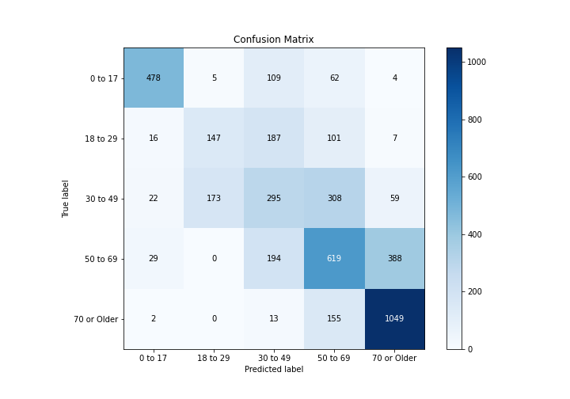

# Summary of 4_Default_NeuralNetwork

[<< Go back](../README.md)

## Neural Network
- **n_jobs**: -1
- **dense_1_size**: 32
- **dense_2_size**: 16
- **learning_rate**: 0.05
- **num_class**: 5
- **explain_level**: 2

## Validation
 - **validation_type**: split
 - **train_ratio**: 0.75
 - **shuffle**: True
 - **stratify**: True

## Optimized metric
logloss

## Training time

8.1 seconds

### Metric details
|           |    0 to 17 |   18 to 29 |   30 to 49 |    50 to 69 |   70 or Older |   accuracy |   macro avg |   weighted avg |   logloss |
|:----------|-----------:|-----------:|-----------:|------------:|--------------:|-----------:|------------:|---------------:|----------:|
| precision |   0.873857 |   0.452308 |   0.369674 |    0.497189 |      0.696085 |   0.585256 |    0.577823 |       0.578705 |   0.94393 |
| recall    |   0.726444 |   0.320961 |   0.344224 |    0.503252 |      0.860541 |   0.585256 |    0.551084 |       0.585256 |   0.94393 |
| f1-score  |   0.793361 |   0.375479 |   0.356495 |    0.500202 |      0.769626 |   0.585256 |    0.559033 |       0.577327 |   0.94393 |
| support   | 658        | 458        | 857        | 1230        |   1219        |   0.585256 | 4422        |    4422        |   0.94393 |

## Confusion matrix
|                        |   Predicted as 0 to 17 |   Predicted as 18 to 29 |   Predicted as 30 to 49 |   Predicted as 50 to 69 |   Predicted as 70 or Older |
|:-----------------------|-----------------------:|------------------------:|------------------------:|------------------------:|---------------------------:|
| Labeled as 0 to 17     |                    478 |                       5 |                     109 |                      62 |                          4 |
| Labeled as 18 to 29    |                     16 |                     147 |                     187 |                     101 |                          7 |
| Labeled as 30 to 49    |                     22 |                     173 |                     295 |                     308 |                         59 |
| Labeled as 50 to 69    |                     29 |                       0 |                     194 |                     619 |                        388 |
| Labeled as 70 or Older |                      2 |                       0 |                      13 |                     155 |                       1049 |

## Learning curves

## Permutation-based Importance

## Confusion Matrix

## Normalized Confusion Matrix

## ROC Curve

## Precision Recall Curve

[<< Go back](../README.md)
