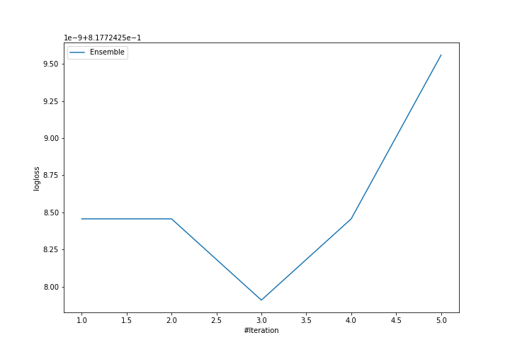
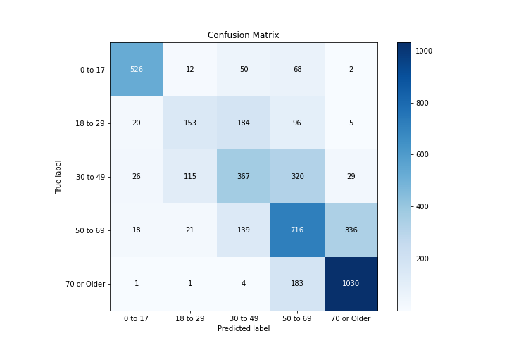
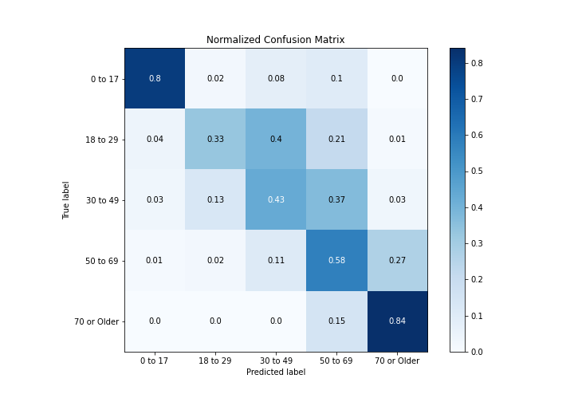
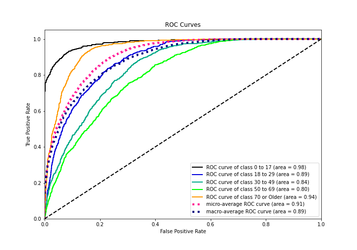
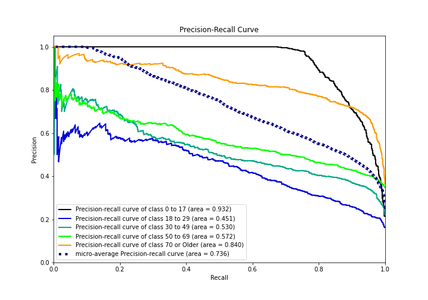

# Summary of Ensemble

[<< Go back](../README.md)

## Ensemble structure
| Model             |   Weight |
|:------------------|---------:|
| 3_Default_Xgboost |        3 |

### Metric details
|           |    0 to 17 |   18 to 29 |   30 to 49 |    50 to 69 |   70 or Older |   accuracy |   macro avg |   weighted avg |   logloss |
|:----------|-----------:|-----------:|-----------:|------------:|--------------:|-----------:|------------:|---------------:|----------:|
| precision |   0.890017 |   0.506623 |   0.49328  |    0.517715 |      0.734665 |   0.631389 |    0.62846  |       0.627035 |  0.817724 |
| recall    |   0.799392 |   0.334061 |   0.428238 |    0.582114 |      0.844955 |   0.631389 |    0.597752 |       0.631389 |  0.817724 |
| f1-score  |   0.842274 |   0.402632 |   0.458463 |    0.548029 |      0.78596  |   0.631389 |    0.607472 |       0.624985 |  0.817724 |
| support   | 658        | 458        | 857        | 1230        |   1219        |   0.631389 | 4422        |    4422        |  0.817724 |

## Confusion matrix
|                        |   Predicted as 0 to 17 |   Predicted as 18 to 29 |   Predicted as 30 to 49 |   Predicted as 50 to 69 |   Predicted as 70 or Older |
|:-----------------------|-----------------------:|------------------------:|------------------------:|------------------------:|---------------------------:|
| Labeled as 0 to 17     |                    526 |                      12 |                      50 |                      68 |                          2 |
| Labeled as 18 to 29    |                     20 |                     153 |                     184 |                      96 |                          5 |
| Labeled as 30 to 49    |                     26 |                     115 |                     367 |                     320 |                         29 |
| Labeled as 50 to 69    |                     18 |                      21 |                     139 |                     716 |                        336 |
| Labeled as 70 or Older |                      1 |                       1 |                       4 |                     183 |                       1030 |

## Learning curves

## Confusion Matrix

## Normalized Confusion Matrix

## ROC Curve

## Precision Recall Curve

[<< Go back](../README.md)
