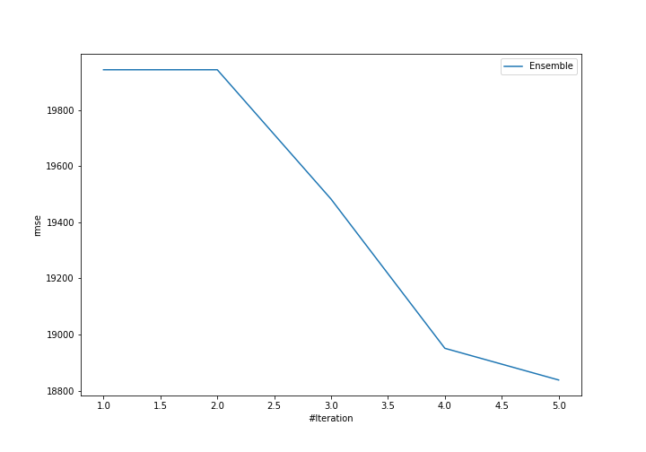
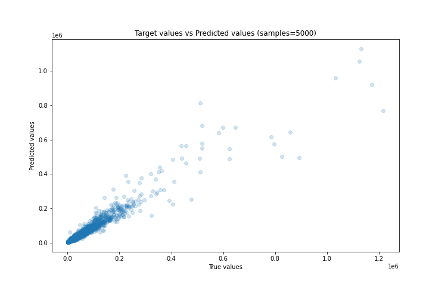
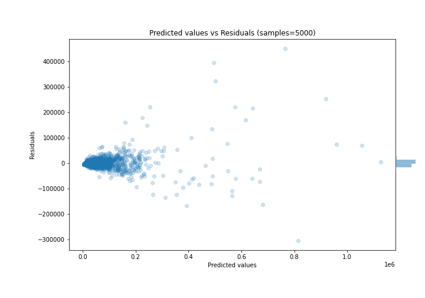

# Summary of Ensemble

[<< Go back](../README.md)

## Ensemble structure
| Model             |   Weight |
|:------------------|---------:|
| 2_DecisionTree    |        1 |
| 3_Default_Xgboost |        4 |

### Metric details:
| Metric   |           Score |
|:---------|----------------:|
| MAE      |  6589.05        |
| MSE      |     3.54867e+08 |
| RMSE     | 18837.9         |
| R2       |     0.932259    |
| MAPE     |     1.00164     |

## Learning curves

## True vs Predicted

## Predicted vs Residuals

[<< Go back](../README.md)
